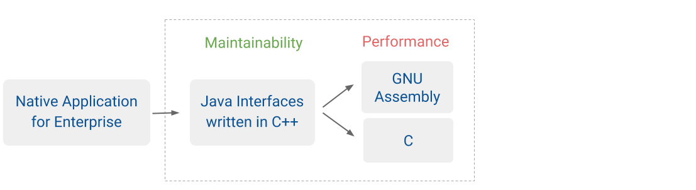

 # Native Library
 [](https://ci.appveyor.com/project/foodtiny/native)&nbsp;[](https://travis-ci.org/foodtiny/native)
 &nbsp;[]()
 &nbsp;[](https://coveralls.io/github/foodtiny/native?branch=master)
 &nbsp;[]()
 

**Native Library** provides a low-level optimization with productivity for C/C++ application.

Beside standard library, we would like to have a greater customization with important goals:

- Blazing fast performance, small footprint & low-level access with GAS & C
- Powerful structured programming in C++ for scalability
- Syntactically enhancement with C++ operators & walk through
- Provide rich Java standard packages for productivity & maintainability
- Zero memory leak with automatic storage and avoid NullPointerException

This project is also useful for new developers in practical programming.

### Getting started

#### Installation
```bash
$ git clone https://github.com/foodtiny/native.git
$ cmake . && make
$ sudo make install
```


### Setup for development
#### Windows
Install CgyWin64 with dependencies below:
- CMake
- Makefile
- GCC
- G++

#### Linux and Mac
Install with apt-get or brew with dependencies below:
- Cmake

#### Test Driven Development
```bash
$ cmake . && make native_test && make leak
```

#### Hello World Program
```java
public class Main {
    public static void main(String[] args) {
        String text = "Native Library: ";
        byte[] bytes = { 72, 101, 108, 108, 111, 32, 87, 111, 114, 108, 100 };
        for (byte number : bytes) {
            text += (char) number;
        }
        System.out.println(text);
    }
}
```
```cpp
#include <native/library.hpp>

int main() {
    String text = "Native Library: ";
    Array<byte> bytes = { 72, 101, 108, 108, 111, 32, 87, 111, 114, 108, 100 };
    for (byte number : bytes) {
        text += (char) number;
    }
    System::out::println(text);
    return 0;
}
```
```bash
$ g++ -c -o test.o ./test.cpp
$ gcc -static -o native test.o -L/usr/local/lib libnative_static.a -lstdc++
$ ./native
```

#### Unit Test with C-Unit
```cpp
#define TESTING
#include <native/unit_test.h>

int main(int argc, const char *argv[]) {
   int result = ctest_main(argc, argv);
   return result;
}

TEST(YourTestSuite, YourTestCase) {
    ASSERT_STR("me", "you");
}
```

### Contributors
- This library must be followed [Oracle Java 8 Documentation](https://docs.oracle.com/javase/8/docs/api) for standardization
- Make sure that your commits must be passed before you create pull request
- At least one contributor in this project reviews your commits (except you) before merging
- Best practices guidelines in [CONTRIBUTION.md](https://github.com/foodtiny/native/tree/master/CONTRIBUTION.md)

### Copyright & license
Copyright © 2014-2016 Food Tiny. All rights reserved, except as follows. Code is released under the Apache 2.0 license.
You may obtain a duplicate copy of the same license, titled CC-BY-SA-4.0, at http://creativecommons.org/licenses/by/4.0/.
Terms and conditions set forth in the file [LICENSE.docs](https://github.com/foodtiny/native/tree/master/LICENSE.docs).

### Useful resources
- [Example for GNU Assembly x64](http://cs.lmu.edu/~ray/notes/gasexamples)
- [GNU Coding Style for C](https://www.gnu.org/prep/standards/html_node/Writing-C.html)
- [GNU Coding Style for C++](https://gcc.gnu.org/wiki/CppConventions)
- [Oracle Java 8 API Documentation](https://docs.oracle.com/javase/8/docs/api/)

# Documentation
#### Differences
This library provides Java classes in C++ so its syntax is friendly for
both programming languages but we still have some issues :

- Namespace - Package
```java
// Java
System.out.println("Java");
```
```cpp
// C++
System::out::println("C++");
```
- Array
```java
// Java
byte[] byes = {};
```
```cpp
// C++
Array<byte> bytes = {};
```
- Interface
```
Coming soon
```
- Runtime
```
Coming soon
```
- Garbage Collection
```
Coming soon
```

#### Data Types
All data types are implemented and ready to use in C++ Application
- [x] char - Java.Lang.Character
- [x] byte - Java.Lang.Byte (equivalent with `unsigned char`)
- [x] string - Java.Lang.String (equivalent with `char*`, Java does not have data type `string`)
- [x] short - Java.Lang.Short
- [x] int - Java.Lang.Integer
- [x] long - Java.Lang.Long
- [x] float - Java.Lang.Float
- [x] double - Java.Lang.Double
- [x] boolean - Java.Lang.Boolean (equivalent with `bool`)
- [x] enum - Java.Lang.Enum

#### Java Standard Packages
All Java packages are in transformation so we can have a general look about road map

##### Java.Lang
- [ ] Java.Lang.Appendable
- [ ] Java.Lang.AutoCloseable
- [x] Java.Lang.Boolean
- [x] Java.Lang.Byte
- [x] Java.Lang.Character
- [ ] Java.Lang.CharSequence
- [ ] Java.Lang.Cloneable
- [ ] Java.Lang.Comparable
- [x] Java.Lang.Double
- [ ] Java.Lang.Enum
- [ ] Java.Lang.Error
- [ ] Java.Lang.Exception
- [x] Java.Lang.Float
- [x] Java.Lang.Integer
- [x] Java.Lang.Iterable
- [x] Java.Lang.Long
- [x] Java.Lang.Math
- [x] Java.Lang.Number
- [x] Java.Lang.Object
- [x] Java.Lang.Process
- [ ] Java.Lang.Readable
- [ ] Java.Lang.Runnable
- [ ] Java.Lang.Runtime
- [x] Java.Lang.Short
- [x] Java.Lang.String
- [x] Java.Lang.System
- [ ] Java.Lang.Throwable
- [ ] Java.Lang.Thread
##### Java.IO
- [ ] Java.Lang.BufferedReader
- [ ] Java.Lang.BufferedWriter
- [ ] Java.Lang.CharArrayWriter
- [ ] Java.Lang.Console
- [ ] Java.Lang.FileDescriptor
- [ ] Java.Lang.FileFilter
- [ ] Java.Lang.FileWriter
- [ ] Java.Lang.Flushable
- [ ] Java.Lang.InputStream
- [ ] Java.Lang.IOError
- [ ] Java.Lang.IOException
- [ ] Java.Lang.ObjectInput
- [ ] Java.Lang.ObjectOutput
- [ ] Java.Lang.OutputStream
- [ ] Java.Lang.OutputStreamWriter
- [ ] Java.Lang.PipedWriter
- [ ] Java.Lang.PrintWriter
- [ ] Java.Lang.Reader
- [ ] Java.Lang.Serializable
- [ ] Java.Lang.StreamTokenizer
- [ ] Java.Lang.Writer

##### Java.Util
- [x] Java.Util.AbstractCollection
- [x] Java.Util.AbstractList
- [ ] Java.Util.AbstractMap
- [ ] Java.Util.AbstractSet
- [x] Java.Util.ArrayList
- [x] Java.Util.Arrays
- [ ] Java.Util.BitSet
- [ ] Java.Util.Base64
- [ ] Java.Util.Calendar
- [x] Java.Util.Collection
- [x] Java.Util.Collections
- [ ] Java.Util.Currency
- [ ] Java.Util.Date
- [ ] Java.Util.EnumMap
- [ ] Java.Util.EnumSet
- [x] Java.Util.HashMap
- [ ] Java.Util.HashSet
- [x] Java.Util.Iterator
- [ ] Java.Util.LinkedListHashSet
- [x] Java.Util.LinkedList
- [ ] Java.Util.List
- [ ] Java.Util.Map
- [ ] Java.Util.Observable
- [ ] Java.Util.PriorityQueue
- [x] Java.Util.Queue
- [ ] Java.Util.Random
- [ ] Java.Util.Scanner
- [ ] Java.Util.Set
- [ ] Java.Util.SimpleTimeZone
- [ ] Java.Util.Stack
- [ ] Java.Util.Timer
- [ ] Java.Util.TimerTask
- [ ] Java.Util.TimeZone
- [ ] Java.Util.TreeSet
- [ ] Java.Util.UUID
- [ ] Java.Util.Vector

##### Java.Security
- [ ] Java.Security.Certificate
- [ ] Java.Security.KeyFactory
- [ ] Java.Security.KeyStore
- [ ] Java.Security.MessageDigest

##### Java.Net
- [ ] Java.Net.HttpURLConnection
- [ ] Java.Net.URL
- [ ] Java.Net.URLEncoder
- [ ] Java.Net.URLDecoder
